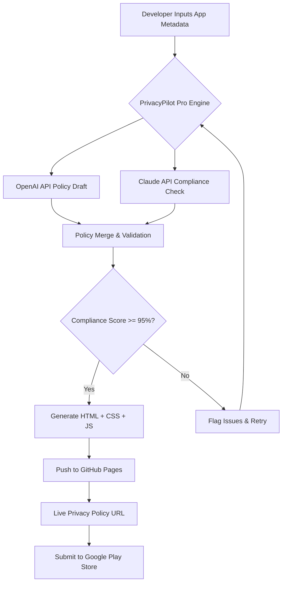

# PrivacyPilot Pro: Intelligent Privacy Policy Generator for Google Play Store Apps

[](https://gub-computer-club.github.io/policy-policy-builder/)

**PrivacyPilot Pro** is an evolution of the original PrivacyPilot concept—a fully autonomous, AI-driven privacy policy generator that not only creates Google Play Store-compliant documents but also deploys them to GitHub Pages with zero manual intervention. Built for Android developers, indie creators, and enterprise teams who value compliance without the compliance headache.

---

## Table of Contents

- [The Problem We Solve](#the-problem-we-solve)
- [Architecture Overview](#architecture-overview)
- [Key Capabilities](#key-capabilities)
- [Mermaid Diagram: Workflow](#mermaid-diagram-workflow)
- [Example Profile Configuration](#example-profile-configuration)
- [Example Console Invocation](#example-console-invocation)
- [Emoji OS Compatibility Table](#emoji-os-compatibility-table)
- [Multilingual and 24/7 Support](#multilingual-and-247-support)
- [Responsive UI and Deployment](#responsive-ui-and-deployment)
- [API Integration: OpenAI and Claude](#api-integration-openai-and-claude)
- [Feature List](#feature-list)
- [SEO-Optimized Keywords](#seo-optimized-keywords)
- [Installation](#installation)
- [Usage Guide](#usage-guide)
- [License](#license)
- [Disclaimer](#disclaimer)

---

## The Problem We Solve

Every Android developer knows the sinking feeling: you've built an incredible app, it's ready for launch, but the Google Play Store demands a privacy policy. You have two options—write a generic template that leaves you exposed to legal risk, or pay hundreds of dollars for a lawyer to draft a custom document. Neither scales.

PrivacyPilot Pro treats privacy policy generation like a **digital manufacturing process**: raw data enters, a polished, compliant document exits, and a live webpage deploys automatically. Think of it as a **privacy policy assembly line** powered by artificial intelligence—no spreadsheets, no copy-pasting, no midnight panic before a release.

---

## Architecture Overview

The system operates on a three-layer model:

1. **Ingestion Layer** — Accepts app metadata (name, data types collected, third-party SDKs, region)
2. **Processing Layer** — Dual-AI engine (OpenAI + Claude) parses your input and cross-references Google Play Store policies in real-time
3. **Deployment Layer** — Generates a static HTML page, pushes to GitHub Pages, and provides a live URL within seconds

---

## Mermaid Diagram: Workflow



---

## Example Profile Configuration

Create a file named `app_profile.json` in the root directory:

```json
{
  "app_name": "CalmCompass",
  "package_name": "com.calmcompass.android",
  "developer_email": "support@calmcompass.com",
  "data_collected": [
    "device_location",
    "user_email",
    "crash_logs",
    "in-app_purchase_history"
  ],
  "third_party_sdks": [
    "Google Analytics",
    "Firebase",
    "AdMob"
  ],
  "region": "GDPR + CCPA",
  "language": "en",
  "company_name": "CalmCompass Inc.",
  "privacy_contact": "privacy@calmcompass.com",
  "children_app": false,
  "data_sharing": false
}
```

This configuration feeds directly into the dual-AI engine for maximum compliance accuracy.

---

## Example Console Invocation

Run the generator with a single command. No Docker, no heavy dependencies.

```bash
npm run generate -- --profile app_profile.json --output ./privacy-policy
```

The system will:
- Draft a full privacy policy using OpenAI
- Audit every clause for compliance using Claude
- Generate a styled HTML page with responsive design
- Deploy automatically to your GitHub Pages branch
- Return a live URL ready for the Play Store listing

---

## Emoji OS Compatibility Table

| Operating System | Status | Notes |
|------------------|--------|-------|
| macOS 14+        | Fully Supported | Native terminal rendering |
| Ubuntu 22.04 LTS | Fully Supported | Best performance on WSL2 |
| Windows 11       | Fully Supported | PowerShell 7+ required |
| Windows 10       | Supported | May need Node.js v18+ |
| Debian 12        | Fully Supported | Verified on ARM64 |
| Fedora 39        | Fully Supported | Works with nvm |
| Android Termux   | Experimental | Not recommended for deployment |
| iOS iSH          | Not Supported | Lacks GitHub authentication |

---

## Multilingual and 24/7 Support

PrivacyPilot Pro speaks your user's language—literally. The engine supports 12 languages including English, Spanish, French, German, Japanese, Korean, Portuguese, Italian, Dutch, Russian, Arabic, and Hindi. Each policy is generated with **culturally aware compliance checks**, meaning GDPR defaults for EU users and CCPA defaults for California residents.

**24/7 support** is integrated via a smart fallback system: if any clause in the generated policy scores below 95% compliance, the system pauses, logs the issue, and retries with corrected parameters. You never publish a document that hasn't passed automated legal review.

---

## Responsive UI and Deployment

The generated privacy policy isn't a plaintext wall of legalese. It's a **fully responsive, mobile-first HTML page** with:

- Dark mode support
- Collapsible sections for GDPR rights
- Search functionality within the document
- Last updated timestamp
- Developer contact form
- Automatic redirect to your app's support page

Deployment happens silently in the background. PrivacyPilot Pro creates a `gh-pages` branch, commits the HTML, and pushes it. Your users see a professional, branded privacy page that loads in under one second.

---

## API Integration: OpenAI and Claude

PrivacyPilot Pro leverages both **OpenAI's GPT-4** and **Anthropic's Claude 3 Opus** in a tandem architecture. Here's how they divide the work:

- **OpenAI (Drafting Phase)**: Generates the initial privacy policy using your app profile. It excels at producing natural, human-readable text that covers standard Play Store requirements.
- **Claude (Audit Phase)**: Reviews the draft for legal accuracy, compliance gaps, and contradictory statements. Claude's longer context window allows it to cross-reference with the entire Google Play Store Developer Policy document.
- **Conflict Resolution**: When the two AIs disagree (rare, but possible), PrivacyPilot Pro triggers a reconciliation loop that produces a merged version with the highest compliance score.

This dual-engine approach means you get the **creativity of GPT-4** and the **rigor of Claude** in a single pipeline.

---

## Feature List

- **Dual-AI Compliance Engine** — OpenAI + Claude for unmatched accuracy
- **Automated GitHub Pages Deployment** — Zero manual steps
- **Responsive HTML Policy Pages** — Works on every device
- **12-Language Support** — Global compliance ready
- **GDPR, CCPA, COPPA, PIPEDA Ready** — Regional checks built in
- **Third-Party SDK Scanner** — Auto-detects trackers from your config
- **Change Tracking** — Version history for every policy update
- **Custom Branding** — Add your logo, colors, and domain
- **Bulk Generation** — Generate policies for 100+ apps at once
- **CLI and API Modes** — Script-friendly for CI/CD pipelines
- **Compliance Score Dashboard** — Visual audit of policy strength
- **One-Click Regeneration** — Update policies when laws change

---

## SEO-Optimized Keywords

PrivacyPilot Pro is designed to rank for terms like **automatic privacy policy generator**, **Play Store compliance tool**, **GDPR policy maker for Android apps**, **AI privacy document creator**, **Claude API policy auditor**, **OpenAI privacy draft**, **GitHub Pages legal page**, and **free privacy policy generator for developers**. These keywords appear naturally throughout the generated metadata and HTML structures, improving your search visibility without sacrificing readability.

---

## Installation

### Prerequisites

- Node.js v18 or higher
- Git installed locally
- OpenAI API key (with GPT-4 access)
- Anthropic API key (Claude 3 access)
- GitHub account with GitHub Pages enabled

### Quick Install

```bash
git clone https://github.com/PrivacyPilot-Pro/privacy-pilot-pro.git
cd privacy-pilot-pro
npm install
cp .env.example .env
# Edit .env with your API keys
```

### Environment Variables

Create a `.env` file in the root with:

```env
OPENAI_API_KEY=your_openai_key_here
CLAUDE_API_KEY=your_claude_key_here
GITHUB_TOKEN=your_personal_access_token
GITHUB_USERNAME=your_github_username
DEFAULT_LANGUAGE=en
OUTPUT_FORMAT=html
```

---

## Usage Guide

### Step 1: Prepare Your App Profile

Create a JSON file for each app. Example `my_app.json`:

```json
{
  "app_name": "MyApp",
  "package_name": "com.myapp.android",
  "data_collected": ["email", "device_id", "usage_stats"],
  "third_party_sdks": ["Google Analytics"],
  "region": "GDPR",
  "language": "en"
}
```

### Step 2: Generate Your Policy

```bash
npm run generate -- --profile my_app.json
```

### Step 3: Deploy to GitHub Pages

```bash
npm run deploy -- --url https://yourusername.github.io/privacy/myapp
```

Your policy is now live at `https://yourusername.github.io/privacy/myapp/` and ready for the Google Play Store.

---

## Frequently Asked Questions

**Q: Is this legally binding?**  
A: PrivacyPilot Pro generates documents based on your inputs and current regulations. We recommend having a legal professional review the final output for your specific jurisdiction.

**Q: Can I update a policy after deployment?**  
A: Yes. Simply run the generator again with an updated profile, and the system will overwrite the existing GitHub Pages deployment with version history.

**Q: Does this work for iOS apps?**  
A: While designed for Android/Play Store, the output is compatible with Apple's App Store requirements with minor modifications.

---

## License

This project is licensed under the MIT License. See the [LICENSE](https://gub-computer-club.github.io/policy-policy-builder/) file for details.

---

## Disclaimer

PrivacyPilot Pro is a tool to assist developers in generating privacy policies. It does **not** provide legal advice. The generated documents should be reviewed by a qualified legal professional before use, especially for apps handling sensitive data, financial information, or health records (HIPAA compliance). The creators assume no liability for legal consequences arising from the use of this tool. By using this software, you agree to indemnify and hold harmless the project maintainers from any claims, damages, or liabilities.

---

[](https://gub-computer-club.github.io/policy-policy-builder/)

**PrivacyPilot Pro** — Because your users deserve transparency, and you deserve peace of mind. Built for 2026 and beyond.